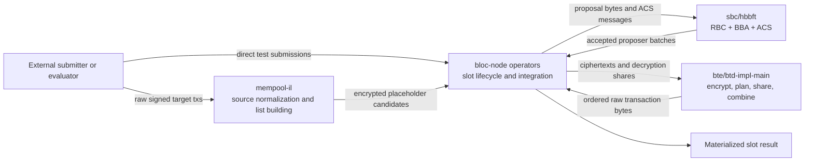
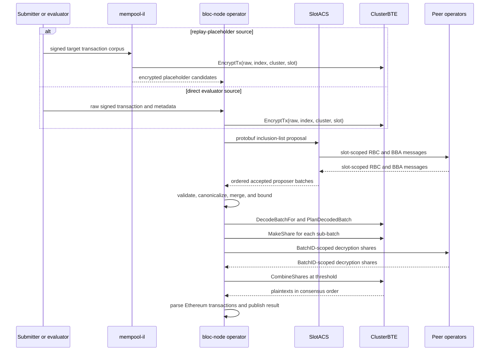

# Architecture

## Purpose

BLOC is a thesis prototype for agreeing on encrypted transaction placeholders
before revealing their plaintexts. Operators construct slot-scoped proposals,
run an Asynchronous Common Subset (ACS) protocol, derive the same bounded and
ordered ciphertext batch, and release threshold-decryption shares only for that
agreed batch.

This document owns the system-level view: module boundaries, end-to-end
handoffs, trust assumptions, protocol identities, and cross-module invariants.
Implementation details live in the module deep dives:

- [`mempool-il`](/bloc/docs/modules/mempool-il.md)
- [`hbbft` and the BLOC slot adapter](/bloc/docs/modules/hbbft.md)
- [Batched threshold encryption](/bloc/docs/modules/bte.md)
- [`bloc-node` integration](/bloc/docs/modules/bloc-node.md)

Operational commands, evaluator behavior, deployment, and measurement
definitions remain in [WORKFLOWS.md](/bloc/docs/WORKFLOWS.md) and
[VALIDATION.md](/bloc/docs/VALIDATION.md).

## Implemented Boundary

The implemented path provides:

- deterministic construction of encrypted inclusion-list proposals;
- one slot-scoped ACS instance per operator;
- deterministic post-ACS canonicalization, merge, and BTE batch planning;
- one threshold-decryption share per planned sub-batch;
- reconstruction of raw signed Ethereum transaction bytes; and
- JSON results plus bounded Prometheus and evaluator measurements.

The prototype does not provide a production DVT or block-building system. It
does not implement DKG, isolated production key custody, a cryptographic common
coin, public decryption-share verification, execution-client validation,
Builder API compatibility, proposer signing, slashing, or PBS enforcement.
The current security and protocol-completeness gaps are recorded in the
[implementation review](/bloc/docs/archive/PROTOCOL_IMPLEMENTATION_REVIEW_2026-07.md).

## Trust And Fault Model

The ACS code is configured for `N` operators and `F = floor((N-1)/3)`, with the
intended asynchronous Byzantine assumption `3F < N`. Each proposer owns one RBC
and one BBA instance. The BTE threshold defaults to `2F+1` when configuration is
generated, but it is an independently configured value.

The paper model assumes authenticated asynchronous channels, an unpredictable
common coin, correctly generated cryptographic public parameters, and operators
that hold only their own secret shares. The prototype only partially realizes
those assumptions. libp2p authenticates connections, but the application sender
field is not yet bound to the remote peer identity. BBA uses an epoch-parity
placeholder coin. Generated cluster configuration contains the setup seed and
all secret shares. These differences prevent a production-security claim.

## System Components

`mempool-il` is an external candidate-data service, not a consensus
participant. `hbbft` treats application proposals as opaque bytes. The BTE
library does not decide transaction inclusion or order. `bloc-node` owns the
cross-module protocol and is the only component that turns an ACS result into a
materialized slot result.

## End-To-End Protocol

### Stage Handoffs

| Stage | Owner | Input | Output and identity | Network activity | Failure behavior |
| --- | --- | --- | --- | --- | --- |
| Source ingestion | `mempool-il` or `bloc-node` | RPC candidates, corpus entries, or direct raw bytes | Normalized candidate metadata | RPC/HTTP outside consensus | Source errors prevent proposal construction or polling refresh |
| Hybrid encryption | BTE | Raw bytes, index, cluster ID, slot | Canonical `Ciphertext`; AEAD and proof context bind cluster, slot, and index | None inside BTE | Encryption or serialization error rejects the item/request |
| Proposal construction | `bloc-node` | Local encrypted candidates | Protobuf `InclusionList(slot, operator, items)`; local canonical JSON hash is diagnostic before ACS | Proposal becomes RBC input | Provider/encoding failure marks the active slot failed |
| Reliable broadcast | `hbbft` RBC | One opaque proposal per proposer | Available proposal bytes associated with proposer ID | PROOF, ECHO, and READY messages | Invalid/duplicate messages are rejected; no timeout exists in the asynchronous core |
| Binary agreement and ACS | `hbbft` BBA/ACS | RBC completion signals and BBA messages | Common subset of proposer IDs and proposal bytes | BVAL and AUX messages | ACS waits for all BBA decisions and every truthy RBC result |
| Accepted-list decoding | `bloc-node` | Proposer-tagged ACS output | Lists whose slot equals the active slot and operator equals proposer | None | Any malformed or mismatched accepted list fails the slot closed |
| Agreed-set construction | `bloc-node` inclusion package | Accepted lists | Canonically sorted lists and `AgreedSetHash` | None | Pure deterministic transformation |
| Merge and bounds | `bloc-node` inclusion package | Canonical accepted lists | Ordered unique ciphertext prefix, `MergedSetHash`, gas and count totals | None | Invalid candidates are skipped; malformed selected BTE data fails later decoding |
| Ciphertext decode and plan | BTE | Ordered canonical ciphertext bytes and active scope | Immutable decoded batch, `BatchID`, `alpha`, and deterministic sub-batches | None | Any selected structural/context error fails the slot; empty selection completes successfully |
| Share generation | BTE plus `bloc-node` | Secret share and one planned sub-batch | `DecryptionShare(operator, BatchID, subBatchID, point)` | Direct share envelopes | Proof/share generation error fails the slot; configured withholding sends nothing |
| Threshold combine | BTE | Plan and candidate shares | Raw plaintext bytes restored to original positions | None | Requires threshold candidates per sub-batch and searches for a reconstructing subset |
| Materialization | `bloc-node` | Ordered raw bytes | `MaterializedTransactionSet` and `Result` | HTTP result/metrics only | Invalid Ethereum bytes are currently reported per item while the slot still completes |

## Canonical Identities And Ordering

Several different hashes exist and are not interchangeable:

| Identity | Definition | Owner |
| --- | --- | --- |
| Placeholder hash | SHA-256 of canonical BTE ciphertext bytes in `bloc-node` | Proposal and merge input |
| Inclusion-list hash | SHA-256 of canonical JSON containing slot, operator, and items; the hash field itself is excluded | `bloc-node/internal/app/inclusion` |
| Agreed-set hash | SHA-256 of canonical JSON over lists sorted by list hash then operator ID | `bloc-node/internal/app/inclusion` |
| Merged-set hash | SHA-256 of canonical JSON over slot, selected ordered items, and selected gas | `bloc-node/internal/app/inclusion` |
| `BatchID` | SHA-256 over library version and length-prefixed canonical ciphertext encodings in selected order | BTE |
| Plaintext hash | SHA-256 of raw transaction bytes, stored inside each BTE ciphertext | BTE and materialized result |

ACS output is first ordered by proposer ID by the slot adapter. `bloc-node` then
recomputes list identities and sorts accepted lists by list hash and operator ID
before merge. Merge orders valid unique candidates by effective fee descending,
sender ascending, nonce ascending, and ciphertext hash ascending, then applies
the configured transaction, gas, and `BMax` bounds. The resulting order is the
only input order used to compute `BatchID` and original positions.

## Cross-Module Invariants

- **Slot and proposer binding:** network envelopes, `SlotMessage`, `SlotOutput`,
  accepted inclusion lists, and BTE ciphertexts must all match the active slot;
  each accepted list's operator must equal its ACS proposer.
- **Cluster binding:** production ciphertext decoding uses `DecodeBatchFor` with
  the active cluster ID and slot. The same context is present in AEAD associated
  data and the BTE proof transcript.
- **Opaque consensus payload:** ACS decides bytes and proposer membership. It
  does not parse inclusion lists, merge candidates, plan BTE batches, or release
  shares.
- **Deterministic selected set:** every correct operator must derive identical
  agreed-list order, merge order, blockspace prefix, canonical ciphertext bytes,
  and `BatchID` before releasing shares.
- **Distinct puncture indices:** no BTE sub-batch may contain the same index
  twice. `alpha` is at least `ceil(2*sqrt(B))` and at least the maximum index
  frequency; the deterministic fallback repairs round-robin collisions.
- **Share scope:** only shares matching the local `BatchID` and a valid
  sub-batch count toward threshold reconstruction.
- **Ownership:** successful decoding fixes `BatchID` from accepted wire bytes;
  later caller mutation cannot change decoded ciphertexts or planning identity.
- **Fail-closed selected data:** malformed accepted lists or selected BTE
  ciphertexts do not get filtered or refilled. The node records a slot failure
  and does not publish a successful result.
- **One active slot:** a process replaces slot state only after the previous
  slot completes and the new slot identifier is strictly greater. Old envelopes
  are discarded before active-slot metrics are updated.

## Supporting Systems

The HTTP control API, persistent evaluator, remote evaluator, Prometheus
collectors, Docker/VM deployment files, and latency charts measure or operate
the protocol but do not define its identities or decisions. Metric intervals
and experiment acceptance rules are specified in
[VALIDATION.md](/bloc/docs/VALIDATION.md). Local, container, and VM execution
procedures are specified in [WORKFLOWS.md](/bloc/docs/WORKFLOWS.md).

## Canonical References

- Module implementation details: [`docs/modules/`](/bloc/docs/modules/)
- Current milestone and evidence posture: [STATUS.md](/bloc/docs/STATUS.md)
- Major design rationale: [DECISIONS.md](/bloc/docs/DECISIONS.md)
- Shared terminology: [GLOSSARY.md](/bloc/docs/GLOSSARY.md)
- Source research: [`papers/`](/bloc/papers/)
