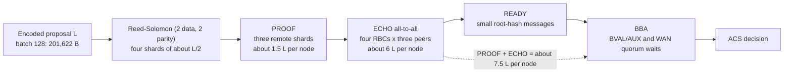

# ACS Communication Latency Findings

## Scope

This report consolidates the source review and accepted issue #23 phase-one
campaign findings for BLOC's `n=4`, `f=1` ACS path. It distinguishes measured
causes from hypotheses and does not make `n=7`, p99, adversarial-liveness, or
production-readiness claims.

The accepted campaign used source `7720b1f5bfce1997f611c1db95cead394b0349c4`,
batches `8/32/128`, five warmups, 30 measured repetitions, same-AZ and
three-region topologies, and fresh and persistent libp2p logical-stream modes.
Every arm retained 90/90 successful, consistent measurements and 420 ACS traces
with zero send failures. See [STATUS.md](../STATUS.md) and
[VALIDATION.md](../VALIDATION.md).

## Conclusions

1. Fresh logical-stream creation is measurable in the same AZ but is not the
   primary cause of cross-region ACS latency.
2. The cross-region critical path is dominated by erasure-coded RBC payload
   dissemination followed by successive RBC and BBA quorum dependencies.
3. Shards are distributed correctly: each proposer initially sends one distinct
   Reed-Solomon shard and Merkle proof to each participant.
4. RBC is not bandwidth-minimal. Every participant subsequently sends its shard
   and proof to every other participant as ECHO. At `n=4`, ECHO accounts for
   approximately 80% of ACS application bytes.
5. Encoded proposals are large. The batch-128 proposal is about 197 KiB, mostly
   because each transaction carries a fixed 1,061-byte BTE ciphertext overhead.
6. One persistent stream per peer introduces head-of-line queueing for large
   concurrent messages. It removes stream churn but does not reduce payload
   volume or protocol rounds.

## Communication And Critical Path

`NewRBC` uses an `(N-2F, 2F)` Reed-Solomon encoder. For `n=4`, `f=1`,
each shard is approximately `L/2`. The proposer sends three remote PROOFs. For
each of four concurrent RBC instances, every node sends its ECHO to three peers.
This produces approximately `7.5L` large-message bytes per node before envelope
and Merkle-proof overhead. The relevant implementation is
[`rbc.go`](../../sbc/hbbft/rbc.go) and [`acs.go`](../../sbc/hbbft/acs.go).

## Measured Stream Effect

ACS p50 values are milliseconds on the run's critical node.

| Topology | Batch | Fresh | Persistent | Change |
| --- | ---: | ---: | ---: | ---: |
| Same AZ | 8 | 17.534 | 8.293 | -52.7% |
| Same AZ | 32 | 27.715 | 18.333 | -33.9% |
| Same AZ | 128 | 63.439 | 50.861 | -19.8% |
| Three region | 8 | 233.209 | 232.449 | -0.3% |
| Three region | 32 | 237.621 | 259.736 | +9.3% |
| Three region | 128 | 515.948 | 523.570 | +1.5% |

Same-AZ p50 confidence intervals were non-overlapping in all three batches. All
three-region p50 intervals overlapped. Both arms already used persistent,
authenticated libp2p peer connections; the experiment changed only whether an
application stream was opened per envelope or reused.

Persistent three-region milestone p50s further locate the critical path:

| Batch | First RBC output | True-BBA quorum | ACS |
| ---: | ---: | ---: | ---: |
| 8 | 72.434 ms | 209.100 ms | 232.449 ms |
| 32 | 144.454 ms | 235.958 ms | 259.736 ms |
| 128 | 428.540 ms | 508.608 ms | 523.570 ms |

The single persistent writer also accumulated 545.796 ms median per-node-trace
queue wait at batch 128, versus about 0.22 ms at batches 8 and 32. This is
head-of-line backpressure, not evidence that persistent streams reduce WAN
round latency.

## Proposal Size And RBC Amplification

| Batch | Encoded proposal | Bytes per item | Predicted PROOF+ECHO per node | Measured median |
| ---: | ---: | ---: | ---: | ---: |
| 8 | 12,234 B | 1,529 B | 89.6 KiB | 91.7 KiB |
| 32 | 50,982 B | 1,593 B | 373.4 KiB | 375.6 KiB |
| 128 | 201,622 B | 1,575 B | 1,476.7 KiB | 1,479.0 KiB |

The prediction is `7.5L`. Its difference from measured bytes falls from 2.38%
at batch 8 to 0.15% at batch 128, consistent with fixed framing and proof
overhead. This indicates expected protocol amplification rather than accidental
full-proposal duplication.

For the retained batch-128 corpus, the mean target transaction is 374 bytes and
the mean BTE ciphertext is 1,435 bytes. The fixed 1,061-byte ciphertext
expansion consists of:

- a 1,008-byte BTE capsule containing one GT point, six G1 points, two scalars,
  an index, and length prefixes;
- 25 bytes of outer wire version and length fields; and
- a 12-byte AES-GCM nonce plus 16-byte tag.

Inclusion-list metadata and protobuf add about 140 bytes per item. Consequently,
metadata compaction alone has limited upside; the group-valued BTE capsule is
the dominant proposal-size cost. See
[`cluster.go`](../../bte/btd-impl-main/be/cluster.go) and
[`messages.proto`](../../bloc-node/proto/bloc/v1/messages.proto).

## Paper Correspondence And Limits

The implementation follows the high-level construction in
[ACS Improvement](../../papers/ACS_Improvement.pdf) and
[HoneyBadgerBFT](../../papers/honeybadger.pdf): `N` parallel RBCs, `N` BBAs,
delayed false inputs, and output from the truthy BBA set. The measured ECHO
dominance closely matches HoneyBadgerBFT's communication analysis.

Absolute latency is not directly comparable. `ACS_Improvement.pdf` reports no
latency experiment. HoneyBadgerBFT evaluates 32--104 nodes, much larger batches,
eight AWS regions, a full epoch, and a threshold-signature common coin. BLOC's
campaign measures four-node ACS only, from local proposal readiness to local
decision.

Two implementation deviations also limit comparison with the paper model:

- BBA uses deterministic epoch parity instead of a cryptographic common coin;
- RBC sends READY after `N-f` valid ECHOs without first performing the paper's
  reconstruction and recomputed-root check, although output remains gated by
  successful reconstruction and commitment verification.

These deviations do not explain the honest, zero-send-failure campaign result,
but they prevent production or adversarial-liveness claims. Additional BBA
message-ordering limitations are documented in
[`docs/modules/hbbft.md`](../modules/hbbft.md).

## Findings By Confidence

**Supported by accepted measurements**

- Fresh streams add same-AZ overhead but do not explain the WAN increase.
- ECHO is approximately 80% of ACS outbound application bytes.
- Proposal size, all-to-all ECHO dissemination, and WAN quorum waits are the
  primary observed latency drivers.
- A single persistent per-peer writer can serialize large concurrent messages.

**Not established**

- That RBC shard assignment is incorrect.
- That GossipSub alone will reduce encoded proposal or shard size.
- That `n=4` results predict `n=7`, p99, Byzantine schedules, or production
  performance.
- That BLOC's absolute latency should match the HoneyBadgerBFT evaluation.

## Recommended Follow-Up

1. Keep the GossipSub phase focused on dissemination, deduplication, and
   concurrency; measure payload bytes separately because GossipSub does not
   intrinsically shrink messages.
2. Evaluate BTE capsule and wire-size reductions. Compact inclusion-list
   metadata is secondary.
3. Retain PROOF/ECHO byte attribution and RBC/BBA milestones in future campaigns
   so changes can be compared with the accepted baseline.
4. Resolve the common-coin and RBC READY deviations before making adversarial
   liveness or protocol-conformance claims.
